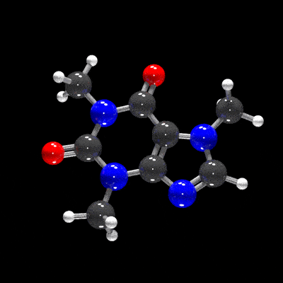

<!-- README.md is generated from README.Rmd. Please edit that file -->

```{r, include = FALSE}
knitr::opts_chunk$set(
  collapse = TRUE,
  comment = "#>",
  fig.path = "man/figures/README-",
  out.width = "100%",
  fig.width=10,
  fig.height=10,
  cache = TRUE
)
```

# raymolecule

</img>

<!-- badges: start -->
[](https://github.com/tylermorganwall/raymolecule/actions/workflows/R-CMD-check.yaml)
<!-- badges: end -->

`raymolecule` is an R package to parse and render molecules in 3D. Rendering is powered by two packages: [rayrender](https://www.rayrender.net/) package, a pathtracer for R, and [rayvertex](https://www.rayvertex.com/), a rasterizer for R. `raymolecule` supports SDF (structure-data file) and PDB (Protein Data Bank) files and can render atom/bond models, ligand overlays, and protein ribbon cartoons.

## Installation

You can install the released version of raymolecule from Github:

```{r eval=FALSE}
install.packages("remotes")
remotes::install_github("tylermorganwall/raymolecule")
```

## Examples

`raymolecule` includes several example SDF files for the following molecules: "benzene", "buckyball", "caffeine", "capsaicin", "cinnemaldehyde", "geraniol", "luciferin", "morphine", "penicillin", "pfoa", "skatole", "tubocurarine_chloride". You can get the file path to these example files using the `get_example_molecule()` function. We pass this path to the `read_sdf()` file to parse the file and extract the atom coordinates and bond information in a list. `raymolecule` also includes the ability to fetch molecules from PubChem using the `get_molecule()` function. The magrittr pipe is automatically imported in the package, so we will use it to pass the output of each function to the input of the next.

Here's the format of the data:

```{r}
library(raymolecule)

get_example_molecule("benzene") |>
	read_sdf()

```

Alternatively, you can fetch any molecule from [PubChem](https://pubchem.ncbi.nlm.nih.gov) by passing either the molecule name. You can also fetch a molecule using the official compound ID (CID), in case you have a specific molecule with a long name or unique isoform:

```{r}
str(get_molecule("estradiol"))

str(get_molecule(5757)) #this is the CID for estradiol (aka estrogen)

```

We can then pass the list from `get_example_molecule() |> read_sdf()` or from `get_molecule()` to the `generate_full_scene()`, `generate_atom_scene()`, or `generate_bond_scene()` functions to convert this representation to a raymesh scene. This can then be passed on the `render_model()` function, which will call rayrender's `render_scene()` or rayvertex's `rasterize_scene()` functions depending on `pathtrace`. This function automatically ensures the molecule is centered and in frame, sets up lighting, and can accept arguments to rotate the molecule. For more rendering options, see `rayrender::render_scene()` and `rayvertex::rasterize_scene()`.

The atom-only and bond-only builders are useful when you want to inspect the simpler pieces of a molecule before rendering a full ball-and-stick model.

```{r atom-bond-scenes}
#Render atoms only for a small built-in molecule
get_example_molecule("benzene") |>
	read_sdf() |>
	generate_atom_scene() |>
	render_model(width = 800, height = 800, samples = 32)

#Render only the bond geometry for a simple built-in molecule
get_example_molecule("cinnemaldehyde") |>
	read_sdf() |>
	generate_bond_scene() |>
	render_model(width = 800, height = 800, samples = 32)
```

```{r}
#Specify a width, height, and number of samples for the image (more samples == less noise)
get_example_molecule("caffeine") |>
	read_sdf() |>
	generate_full_scene() |>
	render_model(width = 800, height = 800, samples = 32)

#Light from both bottom and top
get_example_molecule("cinnemaldehyde") |>
	read_sdf() |>
	generate_full_scene() |>
	render_model(lights = "both", width = 800, height = 800, samples = 32)

#Rotate the molecule and add a non-zero aperture setting to get depth of field effect
get_example_molecule("penicillin") |>
	read_sdf() |>
	generate_full_scene() |>
	render_model(
		lights = "both",
		width = 800,
		height = 800,
		samples = 64,
		angle = c(0, 30, 0),
		aperture = 2,
		fov = 22
	)

```

We can use `rayvertex` to render images much more quickly and noise free, as well as include a toon cel-shading effect.

```{r}
library(rayvertex)

#Render a basic example with rayvertex
get_example_molecule("tubocurarine_chloride") |>
	read_sdf() |>
	generate_full_scene() |>
	render_model(pathtrace = FALSE, width = 800, height = 800, background = "grey66")

#Customize the material with toon shading
shiny_toon_material = material_list(
	type = "toon_phong",
	toon_levels = 3,
	toon_outline_width = 10
)
get_example_molecule("morphine") |>
	read_sdf() |>
	generate_full_scene(
		material_vertex = shiny_toon_material
	) |>
	render_model(pathtrace = FALSE, width = 800, height = 800, background = "grey66")

#Customize the lights with rayvertex
get_example_molecule("skatole") |>
	read_sdf() |>
	generate_full_scene() |>
	render_model(
		pathtrace = FALSE,
		width = 800,
		height = 800,
		angle = c(0, 30, 0),
		background = "grey66",
		lights = directional_light(c(0, 1, 1)) |>
			add_light(directional_light(c(0, -1, 0), color = "red"))
	)

```

You can turn off lighting in `render_model()` and customize the rendered output by using the lower-level rayrender or rayvertex APIs directly. If you use `rayrender::render_scene()`/`rayvertex::rasterize_scene()` instead of `render_model()`, you have to set up the camera position and field of view yourself.


```{r}
library(rayrender)

buckyball = get_example_molecule("buckyball") |>
	read_sdf() |>
	generate_full_scene()

#Add custom lighting, with a custom position determined interactively
# in rayrender by moving to the desired position and pressing "P" to get
# the coordinates.
buckyball |>
	add_object(sphere(
		y = 12,
		radius = 3,
		material = light(color = "white", intensity = 30)
	)) |>
	add_object(sphere(
		y = -12,
		radius = 3,
		material = light(color = "red", intensity = 30)
	)) |>
	add_object(sphere(
		x = 12,
		radius = 3,
		material = light(color = "dodgerblue", intensity = 30)
	)) |>
	add_object(sphere(
		x = -12,
		radius = 3,
		material = light(color = "orange", intensity = 30)
	)) |>
	render_model(
		lights = "none",
		width = 800,
		height = 800,
		samples = 64,
		fov = 10,
		aperture = 1
	)

#Generate ground underneath the model and use a light to cast a shadow
generate_ground(depth = -4, material = diffuse(color = "purple")) |>
	add_object(buckyball) |>
	add_object(sphere(y = 8, z = 12, material = light(intensity = 200))) |>
	render_scene(
		width = 800,
		height = 800,
		samples = 64,
		aperture = 1,
		fov = 20,
		lookfrom = c(5.96, 0.99, 29.43),
		lookat = c(0.80, 0.26, 3.91)
	)

```

## Protein Data Bank Ribbons

`raymolecule` can also download PDB structures from [RCSB](https://www.rcsb.org/), parse multi-model ensembles, and generate ribbon cartoons. This compact beta-barrel example renders a single PDB structure with UV ribbon coloring and hetero overlays.

```{r pdb-examples}
pdb_file = download_pdb("4fsp", out_dir = tempdir(), overwrite = TRUE)
read_pdb(pdb_file, verbose = TRUE) |>
	generate_ribbon_scene(
		color_mode = "uv",
		show_hetero_atoms = TRUE,
		show_hetero_bonds = TRUE
	) |>
	render_model(pathtrace = FALSE, width = 800, height = 800, background = "grey12")
```
