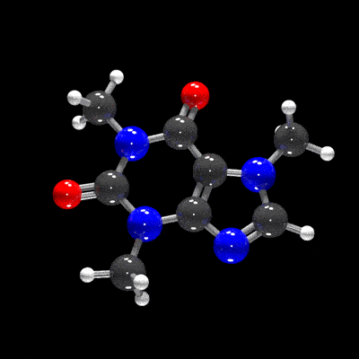
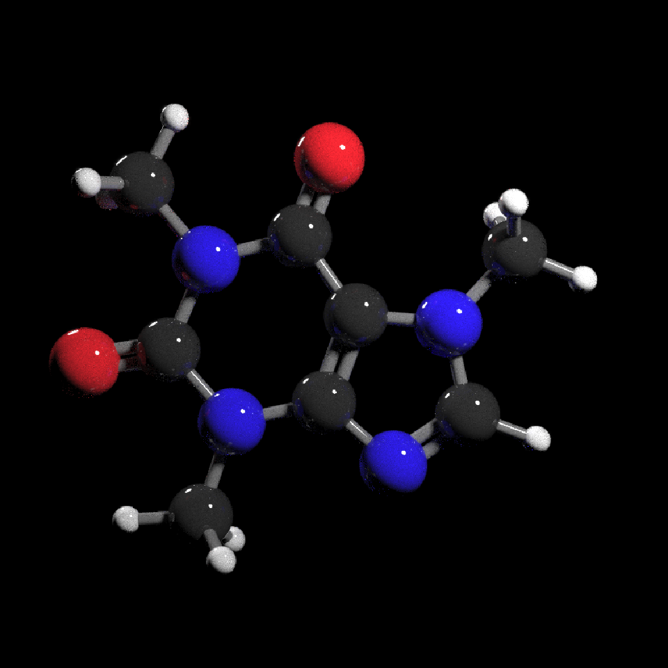
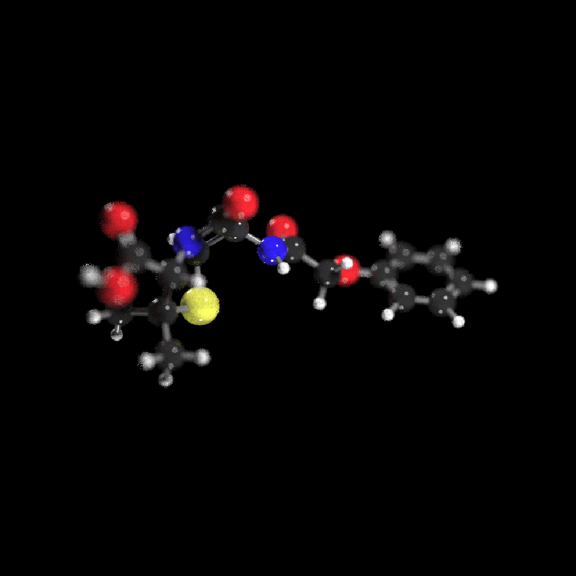
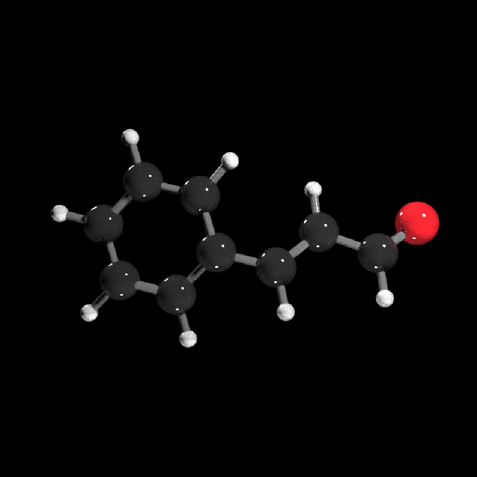

<!-- README.md is generated from README.Rmd. Please edit that file -->

# raymolecule

</img>

<!-- badges: start -->

<!-- badges: end -->

`raymolecule` is an R package to parse and render molecules in 3D.
Rendering is powered by the [rayrender](https://www.rayrender.net/)
package, a pathtracer for R. `raymolecule` currently supports and parses
SDF (structure-data file) and PDB (Protein Data Bank) files and returns
a `rayrender` scene, which we then pathtrace and visualize in R. This
initial release of the package only supports visualizing atoms and
bonds.

## Installation

You can install the released version of raymolecule from Github:

``` r
install.packages("remotes")
remotes::install_github("tylermorganwall/raymolecule")
```

## Examples

`raymolecule` includes several example SDF files for the following
molecules: “benzene”, “buckyball”, “caffeine”, “capsaicin”,
“cinnemaldehyde”, “geraniol”, “luciferin”, “morphine”, “penicillin”,
“pfoa”, “skatole”, “tubocurarine\_chloride”. You can get the file path
to these example files using the `get_example_molecule()` function. We
pass this path to the `read_sdf()` file to parse the file and extract
the atom coordinates and bond information in a list. The magrittr pipe
is automatically imported in the package, so we will use it to pass the
output of each function to the input of the next.

Here’s the format of the data:

``` r
library(raymolecule)

get_example_molecule("benzene") %>%
  read_sdf()
#> $atoms
#>          x       y      z type index
#> 1  -1.2131 -0.6884  0e+00    C     1
#> 2  -1.2028  0.7064  1e-04    C     2
#> 3  -0.0103 -1.3948  0e+00    C     3
#> 4   0.0104  1.3948 -1e-04    C     4
#> 5   1.2028 -0.7063  0e+00    C     5
#> 6   1.2131  0.6884  0e+00    C     6
#> 7  -2.1577 -1.2244  0e+00    H     7
#> 8  -2.1393  1.2564  1e-04    H     8
#> 9  -0.0184 -2.4809 -1e-04    H     9
#> 10  0.0184  2.4808  0e+00    H    10
#> 11  2.1394 -1.2563  1e-04    H    11
#> 12  2.1577  1.2245  0e+00    H    12
#> 
#> $bonds
#>    from to number NA NA NA NA
#> 1     1  2      2  0  0  0  0
#> 2     1  3      1  0  0  0  0
#> 3     1  7      1  0  0  0  0
#> 4     2  4      1  0  0  0  0
#> 5     2  8      1  0  0  0  0
#> 6     3  5      2  0  0  0  0
#> 7     3  9      1  0  0  0  0
#> 8     4  6      2  0  0  0  0
#> 9     4 10      1  0  0  0  0
#> 10    5  6      1  0  0  0  0
#> 11    5 11      1  0  0  0  0
#> 12    6 12      1  0  0  0  0
```

We can then pass this list to the `generate_full_scene()`,
`generate_atom_scene()`, or `generate_bond_scene()` functions to convert
this representation to a rayrender scene. This can then be passed on the
`render_model()` function, which will call rayrender’s `render_scene()`
function to render it. This function automatically ensures the molecule
is centered and in frame, and sets up lighting, and can accept arguments
to rotate the molecule. For more rendering options, see
`rayrender::render_scene()`.

``` r

#Specify a width, height, and number of samples for the image (more samples == less noise)
get_example_molecule("caffeine") %>%
  read_sdf() %>% 
  generate_full_scene() %>% 
  render_model(width=800,height=800,samples=1000, clamp_value=10)
```



``` r

#Light from both bottom and top
get_example_molecule("cinnemaldehyde") %>%
  read_sdf() %>% 
  generate_full_scene() %>% 
  render_model(lights="both",width=800,height=800,samples=1000,clamp_value=10)
```


``` r

#Rotate the molecule and add a non-zero aperture setting to get depth of field effect
get_example_molecule("penicillin") %>%
  read_sdf() %>% 
  generate_full_scene() %>% 
  render_model(lights="both",width=800,height=800,samples=1000,angle=c(0,30,0),aperture=3,
               clamp_value=10)
```



You can turn off lighting in `render_model()` and customize the scene
(adding different objects or lights) by using rayrender’s `add_object()`
function. If you use `rayrender::render_scene()` instead of
`render_model()`, you have to set up the camera position and field of
view yourself.

``` r

library(rayrender)

buckyball = get_example_molecule("buckyball") %>%
  read_sdf() %>% 
  generate_full_scene() 

#Add custom lighting
buckyball %>%
  add_object(sphere(y=12,radius=3,material=light(color="white", intensity=50))) %>% 
  add_object(sphere(y=-12,radius=3,material=light(color="red", intensity=50))) %>% 
  render_model(lights="none",width=800,height=800,samples=1000, clamp_value=10)
```


``` r

#Generate ground underneath the model and use a light to cast a shadow
generate_ground(depth=-4,material=diffuse(sigma=90)) %>%
  add_object(buckyball) %>%
  add_object(sphere(y=8,material=light(intensity=100))) %>% 
  render_scene(width=800,height=800,samples=1000,aperture=1,fov=30,lookfrom = c(0,1,30),
               clamp_value = 10)
```


