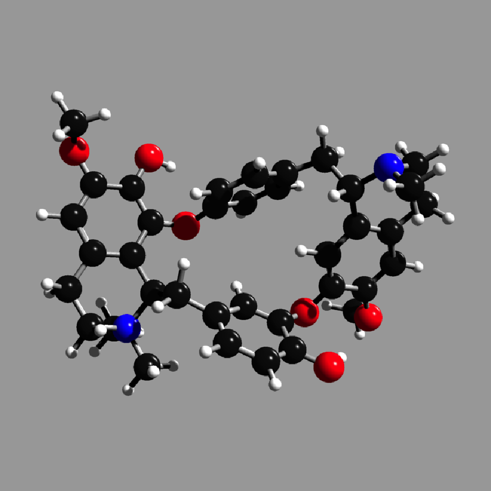
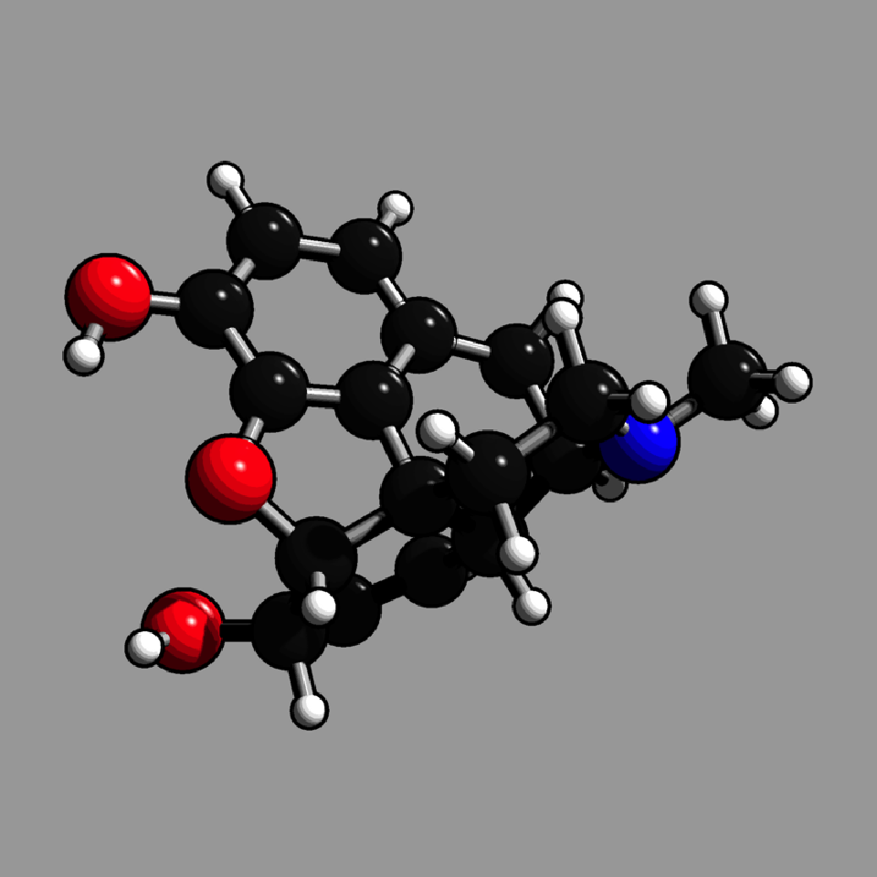
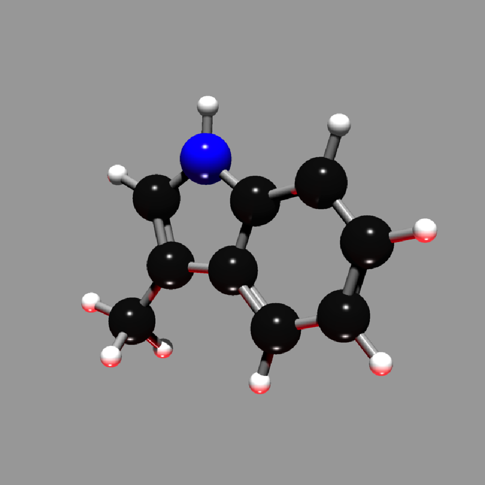
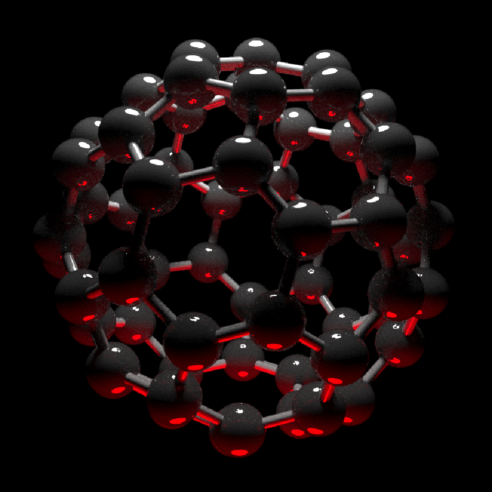

<!-- README.md is generated from README.Rmd. Please edit that file -->

# raymolecule

</img>

<!-- badges: start -->

[](https://github.com/tylermorganwall/raymolecule/actions/workflows/R-CMD-check.yaml)
<!-- badges: end -->

`raymolecule` is an R package to parse and render molecules in 3D.
Rendering is powered by two packages:
[rayrender](https://www.rayrender.net/) package, a pathtracer for R, and
[rayvertex](https://www.rayvertex.com/), a rasterizer for R.
`raymolecule` currently supports and parses SDF (structure-data file)
and PDB (Protein Data Bank) files and returns a `rayrender` scene, which
we then pathtrace and visualize in R. This initial release of the
package only supports visualizing atoms and bonds.

## Installation

You can install the released version of raymolecule from Github:

``` r
install.packages("remotes")
remotes::install_github("tylermorganwall/raymolecule")
```

## Examples

`raymolecule` includes several example SDF files for the following
molecules: “benzene”, “buckyball”, “caffeine”, “capsaicin”,
“cinnemaldehyde”, “geraniol”, “luciferin”, “morphine”, “penicillin”,
“pfoa”, “skatole”, “tubocurarine_chloride”. You can get the file path to
these example files using the `get_example_molecule()` function. We pass
this path to the `read_sdf()` file to parse the file and extract the
atom coordinates and bond information in a list. `raymolecule` also
includes the ability to fetch molecules from PubChem using the
`get_molecule()` function. The magrittr pipe is automatically imported
in the package, so we will use it to pass the output of each function to
the input of the next.

Here’s the format of the data:

``` r

library(raymolecule)

get_example_molecule("benzene")  |> 
  read_sdf()
#> $atoms
#>          x       y      z type index
#> 1  -1.2131 -0.6884  0e+00    C     1
#> 2  -1.2028  0.7064  1e-04    C     2
#> 3  -0.0103 -1.3948  0e+00    C     3
#> 4   0.0104  1.3948 -1e-04    C     4
#> 5   1.2028 -0.7063  0e+00    C     5
#> 6   1.2131  0.6884  0e+00    C     6
#> 7  -2.1577 -1.2244  0e+00    H     7
#> 8  -2.1393  1.2564  1e-04    H     8
#> 9  -0.0184 -2.4809 -1e-04    H     9
#> 10  0.0184  2.4808  0e+00    H    10
#> 11  2.1394 -1.2563  1e-04    H    11
#> 12  2.1577  1.2245  0e+00    H    12
#> 
#> $bonds
#>    from to number
#> 1     1  2      2
#> 2     1  3      1
#> 3     1  7      1
#> 4     2  4      1
#> 5     2  8      1
#> 6     3  5      2
#> 7     3  9      1
#> 8     4  6      2
#> 9     4 10      1
#> 10    5  6      1
#> 11    5 11      1
#> 12    6 12      1
```

Alternatively, you can fetch any molecule from
[PubChem](https://pubchem.ncbi.nlm.nih.gov) by passing either the
molecule name. You can also fetch a molecule using the official compound
ID (CID), in case you have a specific molecule with a long name or
unique isoform:

``` r

str(get_molecule("estradiol"))
#> List of 2
#>  $ atoms:'data.frame':   44 obs. of  5 variables:
#>   ..$ x    : num [1:44] 5.061 -5.857 2.664 1.984 0.515 ...
#>   ..$ y    : num [1:44] 1.15 0.148 0.584 -0.695 -0.78 ...
#>   ..$ z    : num [1:44] 0.2674 0.4388 0.1481 -0.3789 0.0353 ...
#>   ..$ type : chr [1:44] "O" "O" "C" "C" ...
#>   ..$ index: int [1:44] 1 2 3 4 5 6 7 8 9 10 ...
#>  $ bonds:'data.frame':   47 obs. of  3 variables:
#>   ..$ from  : num [1:47] 1 1 2 2 3 3 3 3 4 4 ...
#>   ..$ to    : num [1:47] 7 40 20 44 4 7 8 13 5 9 ...
#>   ..$ number: num [1:47] 1 1 1 1 1 1 1 1 1 1 ...

str(get_molecule(5757)) #this is the CID for estradiol (aka estrogen)
#> List of 2
#>  $ atoms:'data.frame':   44 obs. of  5 variables:
#>   ..$ x    : num [1:44] 5.061 -5.857 2.664 1.984 0.515 ...
#>   ..$ y    : num [1:44] 1.15 0.148 0.584 -0.695 -0.78 ...
#>   ..$ z    : num [1:44] 0.2674 0.4388 0.1481 -0.3789 0.0353 ...
#>   ..$ type : chr [1:44] "O" "O" "C" "C" ...
#>   ..$ index: int [1:44] 1 2 3 4 5 6 7 8 9 10 ...
#>  $ bonds:'data.frame':   47 obs. of  3 variables:
#>   ..$ from  : num [1:47] 1 1 2 2 3 3 3 3 4 4 ...
#>   ..$ to    : num [1:47] 7 40 20 44 4 7 8 13 5 9 ...
#>   ..$ number: num [1:47] 1 1 1 1 1 1 1 1 1 1 ...
```

We can then pass the list from `get_example_molecule() |> read_sdf()` or
from `get_molecule()` to the `generate_full_scene()`,
`generate_atom_scene()`, or `generate_bond_scene()` functions to convert
this representation to a rayrender/rayvertex scene. This can then be
passed on the `render_model()` function, which will call rayrender’s
`render_scene()` or rayvertex’s `rasterize_scene()` functions to render
it. This function automatically ensures the molecule is centered and in
frame, and sets up lighting, and can accept arguments to rotate the
molecule. For more rendering options, see `rayrender::render_scene()`
and `rayvertex::rasterize_scene()`.

``` r

#Specify a width, height, and number of samples for the image (more samples == less noise)
get_example_molecule("caffeine") |>
  read_sdf() |> 
  generate_full_scene() |> 
  render_model(width=800,height=800,samples=1000, clamp_value=10)
#> Warning in render_scene(scene = scene, fov = fov, lookfrom = c(0, 0, widest * :
#> "sobol_blue" sample method only valid for `samples` than or equal to
#> 256--switching to `sample_method = "sobol"`
```


``` r

#Light from both bottom and top
get_example_molecule("cinnemaldehyde") |>
  read_sdf() |> 
  generate_full_scene() |> 
  render_model(lights="both",width=800,height=800,samples=1000,clamp_value=10)
#> Warning in render_scene(scene = scene, fov = fov, lookfrom = c(0, 0, widest * :
#> "sobol_blue" sample method only valid for `samples` than or equal to
#> 256--switching to `sample_method = "sobol"`
```


``` r

#Rotate the molecule and add a non-zero aperture setting to get depth of field effect
get_example_molecule("penicillin") |>
  read_sdf() |> 
  generate_full_scene() |> 
  render_model(lights="both",width=800,height=800,samples=1000,angle=c(0,30,0),aperture=3,
               clamp_value=10)
#> Warning in render_scene(scene = scene, fov = fov, lookfrom = c(0, 0, widest * :
#> "sobol_blue" sample method only valid for `samples` than or equal to
#> 256--switching to `sample_method = "sobol"`
```


We can use `rayvertex` to render images much more quickly and noise
free, as well as include a toon cel-shading effect.

``` r

library(rayvertex)

#Render a basic example with rayvertex
get_example_molecule("tubocurarine_chloride") |>
  read_sdf() |> 
  generate_full_scene(pathtrace=FALSE) |> 
  render_model(width=800,height=800,background="grey66")
```



``` r

#Customize the material with toon shading
shiny_toon_material = material_list(type="toon_phong",
                                    toon_levels=,
                                    toon_outline_width=0.1)
get_example_molecule("morphine") |>
  read_sdf() |> 
  generate_full_scene(pathtrace=FALSE, material_vertex = shiny_toon_material) |> 
  render_model(width=800,height=800,background="grey66")
```



``` r

#Customize the lights with rayvertex
get_example_molecule("skatole") |>
  read_sdf() |> 
  generate_full_scene(pathtrace=FALSE) |> 
  render_model(width=800,height=800,angle=c(0,30,0), background="grey66",
               lights = directional_light(c(0,1,1)) |>
                        add_light(directional_light(c(0,-1,0),color="red")))
```



You can turn off lighting in `render_model()` and customize the scene
(adding different objects or lights) by using rayrender’s `add_object()`
function or rayvertex’s `add_shape()` function. If you use
`rayrender::render_scene()`/`rayvertex::rasterize_scene()` instead of
`render_model()`, you have to set up the camera position and field of
view yourself.

``` r

library(rayrender)

buckyball = get_example_molecule("buckyball") |>
  read_sdf() |> 
  generate_full_scene() 

#Add custom lighting
buckyball |>
  add_object(sphere(y=12,radius=3,material=light(color="white", intensity=50))) |> 
  add_object(sphere(y=-12,radius=3,material=light(color="red", intensity=50))) |> 
  render_model(lights="none",width=800,height=800,samples=1000, clamp_value=10)
#> Warning in render_scene(scene = scene, fov = fov, lookfrom = c(0, 0, widest * :
#> "sobol_blue" sample method only valid for `samples` than or equal to
#> 256--switching to `sample_method = "sobol"`
```



``` r

#Generate ground underneath the model and use a light to cast a shadow
generate_ground(depth=-4,material=diffuse(sigma=90)) |>
  add_object(buckyball) |>
  add_object(sphere(y=8,material=light(intensity=100))) |> 
  render_scene(width=800,height=800,samples=1000,aperture=1,fov=30,lookfrom = c(0,1,30),
               clamp_value = 10)
#> Warning in render_scene(add_object(add_object(generate_ground(depth = -4, :
#> "sobol_blue" sample method only valid for `samples` than or equal to
#> 256--switching to `sample_method = "sobol"`
```


